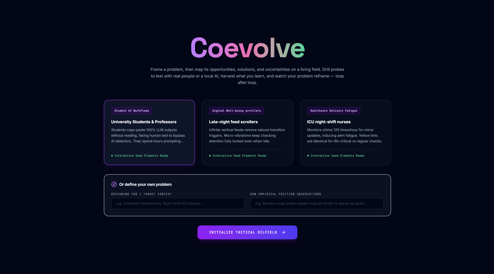
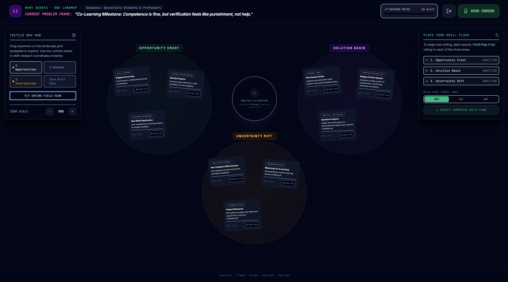

# Coevolve — A Co-Evolutionary Design Field

A playable system for the GenAI Games course (Hochschule München). Coevolve turns the
co-evolution of problem and solution — as described by design theorists like Kees Dorst
and Nigel Cross — into an interactive, loopable game: every probe you run and every
finding you harvest mutates the problem frame itself.

> **Frame a problem, then map its opportunities, solutions, and uncertainties on a
> living field. Drill probes to test with real people or a local AI, harvest what you
> learn, and watch your problem reframe — loop after loop.**



## How the game works

The core loop has five stages, shown in the footer of the app
(`Frame · Probe · Harvest · Reframe`):

1. **Frame** — Start from a Problem Frame: pick one of the seeded scenarios (e.g.
   "University students copy-paste 100% LLM outputs without reading") or define your
   own audience + raw friction observations.
2. **Landscape** — The AI generates a live design landscape of exactly 9 cards on a
   tactile, draggable field: 3 **Opportunity Areas** (angles for intervention),
   3 **Solution Families** (concrete concepts), and 3 **Uncertainty Fields** (critical
   assumptions to test). You curate: expand any card into pro / contra / open-question
   branches, inject a surprise wild card, re-roll any single card that doesn't
   resonate (↻ icon), and plant one **Drill Flag** in each of the three areas to
   commit to a configuration.
3. **Probe** — Your selected Opportunity + Solution + Uncertainty are synthesized into
   a single **Probe Family**: a named prototype with a description and an actionable
   "probe seed" — a test you could deploy within 24 hours.
4. **Harvest** — Run the probe and collect findings. Two modes:
   - **Real workshop**: the AI turns the probe into a runnable 30-minute workshop brief
     (objective, who to invite, timed agenda, what to capture). You run it with real
     people and paste your notes back in; a facilitator AI helps you prep and debrief,
     and sorts the discussion into brief additions vs. genuine findings.
   - **Simulated**: the AI role-plays a qualitative researcher and generates plausible
     findings — always at least one promising signal and one unexpected friction.
5. **Reframe** — The co-evolution engine reads the accumulated evidence and **mutates
   the Problem Frame** into a new, sharper statement (e.g. "Competence is fine, but
   verification feels like punishment, not help"). A **Reframe-Meter** tracks the
   semantic drift away from your starting point across loops. The whole landscape is
   then regenerated around the mutated frame — shaped by the fresh evidence and barred
   from repeating cards explored in earlier loops — and the loop restarts.



## GenAI setup

All generative content comes from a **local LLM via [Ollama](https://ollama.com)**
(default model `qwen2.5:7b`) — no cloud API, no canned fallback content. The Express
server ([server.ts](server.ts)) wraps the model in seven role-prompted endpoints, each
constrained to a strict JSON schema:

| Endpoint | AI role | What it generates |
| --- | --- | --- |
| `POST /api/landscape/generate` | Service Design Coach & Game Master | The 3×3 card landscape from the current Problem Frame |
| `POST /api/landscape/expand-card` | Design strategist | Pro / contra / open-question branches for one card |
| `POST /api/landscape/synthesize-probe` | Service Design Coach | Probe Family (title, methodology, 24h probe seed) from the 3 flagged cards |
| `POST /api/workshop/brief` | Design-research facilitator | Runnable 30-min real-workshop plan for the probe |
| `POST /api/workshop/discuss` | Workshop facilitator (multi-turn chat) | Conversational co-thinking + 3 reply suggestions |
| `POST /api/workshop/apply` | Facilitator/synthesizer | Sorts a prep/debrief conversation into recap, brief additions, and findings |
| `POST /api/landscape/harvest` | Qualitative Design Researcher | 2–3 plausible findings (one positive signal, one new friction) |
| `POST /api/landscape/reframe-problem` | Co-evolutionary design theorist | Mutated Problem Frame + drift score delta |

The full system prompts are in [server.ts](server.ts). Human input is treated as ground
truth: pasted workshop notes are injected into generation prompts with an instruction to
build on them rather than invent around them.

The initial app scaffold was generated with Google AI Studio and then substantially
extended (local Ollama backend, workshop mode, card expansion, reframe engine).

## Example outputs

**Applied design challenge: helping students use AI well for study work.**
*How might we help students use AI in ways that improve learning rather than replace
it?* The investigation covered current AI use in research, writing, coding, and exam
prep; unclear rules, quality checks, overtrust, and guilt; and how AI changes learning
habits and responsibilities. Possible service directions included an AI study
companion, an academic-integrity support flow, a prompt practice service, and an AI
quality-checking ritual — target audience: other students. Playability is treated as a
solution quality: the system makes judgement *practiceable* — students compare outputs,
spot hallucinations, test confidence, and reflect on their own learning.

### Session trace — 3 completed co-evolutionary loops

**Initial Problem Frame.** Designing for university students under deadline pressure
who want to use GenAI tools (ChatGPT, Claude, Copilot) meaningfully without replacing
their own learning. Seeded with three raw observations:

- **The 2:00 AM Crunch** — under deadline panic, students let AI write whole blocks of
  code or text; immediate relief, followed by deep anxiety that they couldn't explain
  the work if asked.
- **The Vending Machine** — when AI errors or hallucinates, students don't analyze the
  logic; they blindly hit "regenerate" / "fix this" until it magically works.
- **The Gray-Zone Panic** — vague "use AI responsibly" rules breed AI guilt and
  imposter syndrome, so students hide their real workflows from instructors.

**How the frame evolved across the loops:**

| Loop | Flagged configuration (Opportunity / Solution / Uncertainty) | Probe seed | Key evidence harvested |
| --- | --- | --- | --- |
| 1 | Skill Integration / GenAI Tutor / User Adoption | Deploy AI tutoring sessions at midnight for one week; track usage and feedback | *Midnight Engagement Surge* (students surprisingly energized late at night) vs. *AI Tutor Fatigue* (exhaustion, sleep disruption) |
| 2 | Real-Time Feedback / Dynamic Socratic Sparring Ring / Repetitive Fatigue Thresholds | Timed, adaptive quiz sequence; feedback on session length and pacing | Engagement peaks at midnight but questioning intensity overwhelms after ~1h; too-rapid pacing triggers fatigue and skipped answers |
| 3 | Adaptive Scaffolding Space / Interactive Workshops / Long-Term Impact | Dynamic intensity reductions after midnight to test effects on student autonomy | *Increased Student Trust* (adaptive system felt trusting, kept effort up late) vs. *Fatigue Management Challenges* (rapid cognitive decline after midnight) |

**Final mutated Problem Frame:** *"Trust Erosion vs. Fatigue: Midnight's Cognitive
Quagmire"* — Reframe-Meter drift: **45%** from the starting point.

**What the system revealed.** The problem co-evolved away from "AI replacing learning"
toward a sharper tension the initial frame never mentioned: students do their real
AI-assisted cognitive work at midnight, exactly when trust in themselves and their
capacity to think critically is lowest. Each loop kept surfacing the same
signal-vs-friction pair — engagement peaks late at night, but so does cognitive
collapse — suggesting that any "use AI well" service has to be designed for the tired,
anxious 2:00 AM student, not the idealized daytime one.

*(Honest limits: the local 7B model occasionally bleeds metaphors — loop 3 briefly
talks about "workout intensity" and "complex movements" — a visible trade-off of
running fully local instead of a frontier cloud model.)*

## Run locally

**Prerequisites:** [Node.js](https://nodejs.org) and [Ollama](https://ollama.com).

1. **Start Ollama** (the desktop app, or `ollama serve` in a terminal).
2. **Pull the model:**
   ```
   ollama pull qwen2.5:7b
   ```
3. **Install dependencies:**
   ```
   npm install
   ```
4. *(Optional)* copy `.env.example` to `.env` to point at a different host or model:
   ```
   OLLAMA_HOST="http://localhost:11434"
   OLLAMA_MODEL="qwen2.5:7b"
   ```
5. **Run the app:**
   ```
   npm run dev
   ```
   Then open http://localhost:3000.

### Configuration

| Variable       | Default                  | Description                          |
| -------------- | ------------------------ | ------------------------------------ |
| `OLLAMA_HOST`  | `http://localhost:11434` | Base URL of the Ollama server.       |
| `OLLAMA_MODEL` | `qwen2.5:7b`             | Any model you've pulled into Ollama. |

> The app requires Ollama to be reachable. If it is down or the model isn't pulled,
> the in-game actions report an error (no canned content is served). The first
> generation may be slow while the model loads into memory.

### Production build

```
npm run build   # vite build + bundle the server
npm start       # serve the built app
```
